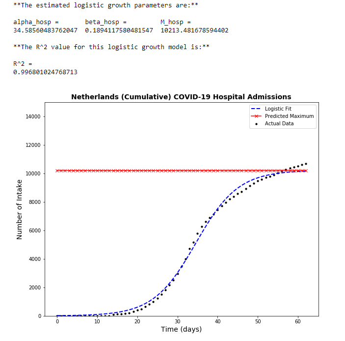

### Hospital Admissions (DEPRECATED) 

**IMPORTANT**: Logistic growth is not 'suitable' for hospital & ICU admissions, because the logistic growth curve is only taking the admissions into account, but not the discharge of the patients (recovered or deceased). 
Thus, the section of **Hospital Admission** and **ICU Admissions** under Logistic Growth are **_deprecated (on Github)_**

The logistic growth curve and its statistics for hospital admissions in the Netherlands:

  

### ~~ICU Admissions~~ (DEPRECATED) 

The logistic growth curve and its statistics for the ICU admissions in the Netherlands:

  

**Note: The actual data passes the predicted maximum, but these models are still valid, meaning that there exist a chance that the actual admissions can pass the predicted maximum. Therefore, it is important use these models to achieve insights when taking preventive measurements.**