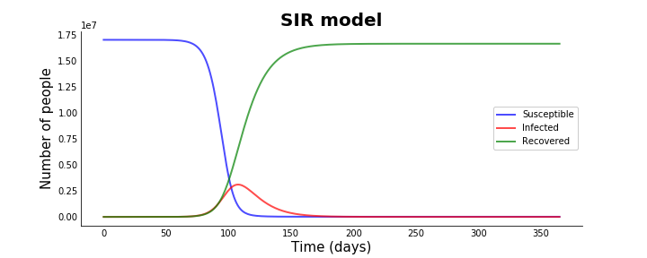
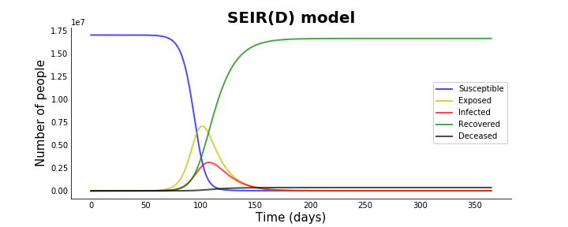
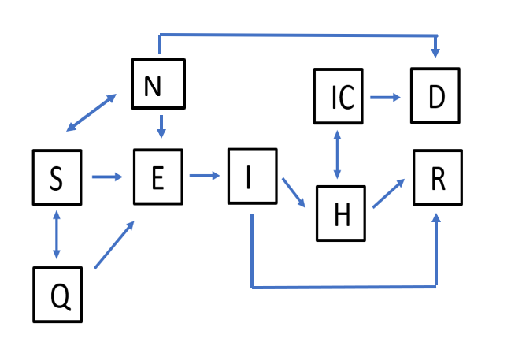
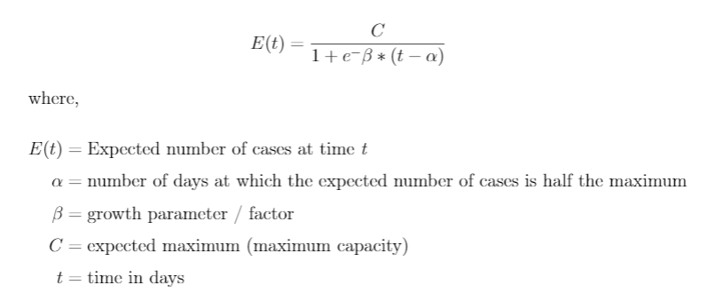
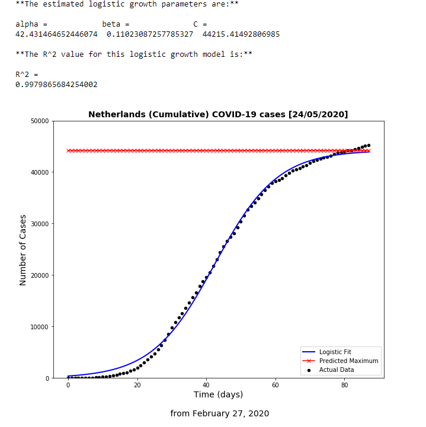
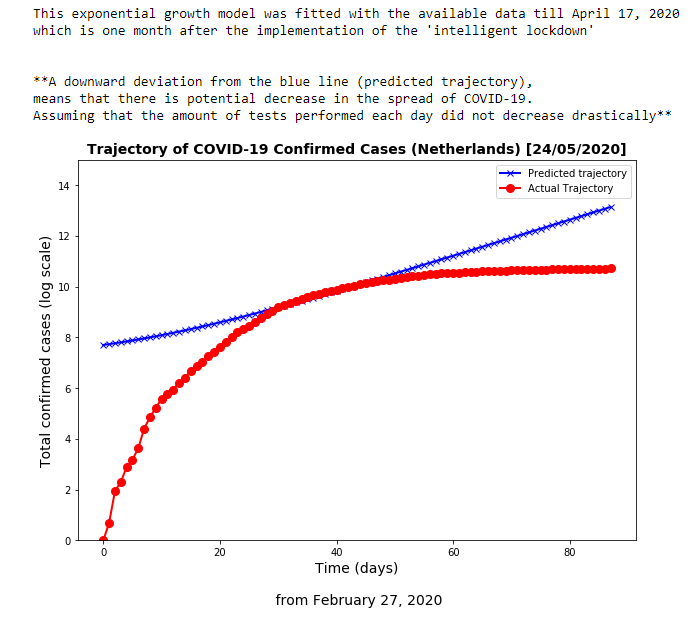
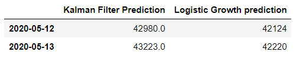
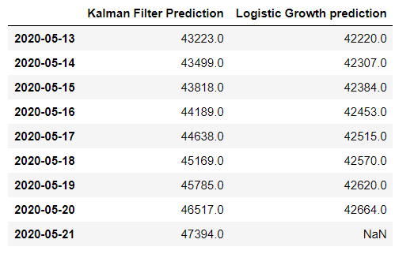
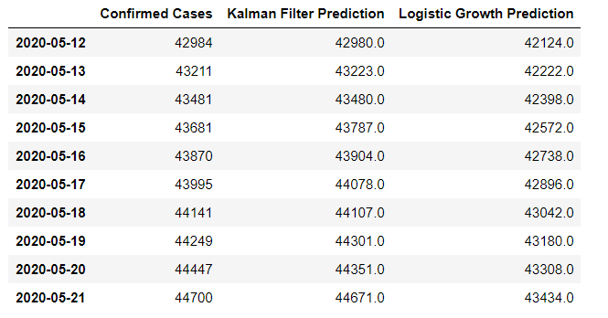

# BEP-SBMD-COVID19

This repository (*in the folder "notebook"*) contains the codes and logs for my **"Bachelor Eind Project" (BEP) at Eindhoven University of Technology, Department of Biomedical Engineering** regarding the topic and research of COVID-19. This work will focus on the *data of COVID-19 in the Netherlands.* 

The supervisors for my BEP are: 
1. *prof. dr. ir. N.A.W. van Riel*
2. *dr. D. Bosnacki* 

## Introduction 

**COVID-19 (Coronavirus disease 2019)** is an ongoing world crisis, declared as a pandemic by the WHO (*World Health Organization*), caused by the virus **SARS-CoV-2 (Severe acute respiratory syndrome coronavirus 2)**.

The spread of COVID-19 is a serious threat to the global health. In the past month, many scientists have used their knowledge and skills (regarding infectious disease modelling, epidemics and statistics) to create models and simulations for the spread of COVID-19. 

While it might be easy to gather data and fitting a model, an **_in silico experiment_** is often different from reality. Hence, there are many different approaches and models to simulate the spread of COVID-19. Furthermore, depending on the purpose or what question has to be answered, different models should be used. These models are only as good as the data they rely on, thus not one model is perfect or the "go-to answer" to this pandemic. Nevertheless, by using existing data and fitting a model, the severity and the spread of this disease can be simulated. 
The latter information is important, because with this, the government, healthcare companies or hospitals can take preventive measurements (such as necessary lockdowns, making sure that there are enough medical supplies and/or that the hospitals and ICU (*Intensive Care Unit*) are not overloaded).

This BEP will focus on different models for the modelling and prediction of the spread
of **COVID-19 in the Netherlands**. Many existing epidemic models are based on the *SIR
or SEIR models*. Popular model for the prediction of daily cases, is to use a *3 parameters logistic
growth curve*, developed by Pierre François Verhulst. However, it is also possible to use
a more dynamic model, such as the *Kalman filter*. Since the spread of COVID-19 in
the Netherlands can be seen as a system that is continuously changing and as a real-time
problem, using a Kalman filter might be an ideal approach for estimations.

For the different types of models, there are many advantages but also caveats. Thus, knowing in which situation and when one model should be used instead of the other models is important to tackle the spread of COVID-19. 

## Software

The programming language used for this project is Python and the codes are executed on a juypter notebook. The packages used for the models can be found in the corresponding notebooks.

## Data
The data that were used for this research are included in the folder _"data"_ and are obtained from the website of **RIVM (National Institute for Public Health and the Environment)**.
The data redarding the ICU  admission is obtained from **Stichting Nice (National Intensive Care Evaluatie): https://www.stichting-nice.nl/**

## 1. SIR/SEIR model 

Both **SIR** and **SEIR** are compartmental models in epidemiology, which consist of differential equations, which simulates the input/output at each compartment. With the correct estimation of the parameters in these equations, it is possible to simulate the course/spread of COVID-19. 

[Click here to view the notebook/codes regarding the SIR/SEIR models](./notebook/SIR_and_SEIR-models.ipynb)

For the estimation of the parameters in the SEIRD model (using the COVID-19 data of the Netherlands):

[Click here for the parameter estimation of the SEIRD model, using the data of COVID-19 in the Netherlands](./notebook/estimating_sir-params.ipynb)

  
The main advantage is that these models are independent from the actual data, thus even without proper or insufficient testing, _**the amount of people who are infected or exposed to this infectious disease, can be estimated**_. This is important, because with this information, the government, healthcare companies or hospitals can take preventive measurements (such as necessary lockdowns, making sure that there are enough medical supplies and/or that the hospitals and ICU are not overloaded).

**After all, the true number of infected person can only be verified with large testing of the population**. 
### SIR model 

The **SIR (Susceptible-Infected-Recovered)** model is one of the most basic compartmental model for epidemiology. This is a dynamic simulation model and can be used to simulate the course/spread (over a time range) of an infectious disease, such as COVID-19. 
 
 
As seen from the abbreviation of the model, it contains 3 different compartments: 
1. Susceptible (amount of people that can get infected)
2. Infected    ( amount of people who are already infected and can infect others)
3. Recovered   (amount of people recovered from the infectious disease)

Below an example of such simulation is given (in a graph):
 

  

_**Note: This curve is not the actual curve that simulates the spread of COVID-19 in the Netherlands. The parameters were freely chosen for for the purpose to generate the plot**_

However, this model lacks complexity to simulate COVID-19. In this simulation it can be seen that eventually all "susceptibles" would be infected and later on fully recovered. Unfortunately, this is not the case with COVID-19, where there are extra compartments such as: **Exposed** and **Death**.

By adding more compartments, such as hospital admission or ICU admission, these models can be more complex and closer to "real-life problems".

### SEIR(D) model

A more realistic model, to simulate COVID-19, is achieved by adding more compartments, such as number of **Exposed** and **Deaths**. Since, not every person who are exposed to this infectious disease are immediately infected, it would be logical to add an **Exposed** compartment. Futhermore, with each infectious disease, especially the COVID-19 the death count should also be added as a compartment. 

The **SEIR (Susceptible-Exposed-Infected-Recovered)** model, does not include the death counts (although this can be seen as *recovered*, thus a modification is to add a **Death** compartment to this model) making it the **SEIR(D)** model. 

Below an example of such simulation is given (in a graph):

  

_**Note: This curve is not the actual curve that simulates the spread of COVID-19 in the Netherlands. The parameters were freely chosen for for the purpose to generate the plot**_

This model can be interesting when simulating the spread of COVID-19 in a given country, because with the correctly estimated parameters, it is possible to get an estimation of the amount of people who are **Infected** or **Exposed** to COVID-19. Therefore, even with a lack of testing, it is possible to get an idea of how many people are exposed or infected. Furthermore, which such models, it is possible to see whether the imposed measurements will "flatten the curve".

**Once again, the true number of infected person can only be verified with large testing of the population**.

### Adjustment and modification of the compartment models

As mentioned in the previous paragraph, these compartment models can have a high complexity. More compartments, such as **quarantined population** or **hospital admissions** can also be added. The models' predictions or simulations would not be dependent on the available data, but the available data is necessary to determine the different parameters in the differential equations found in these models, so the  predictions and simulations' accuracy can be improved.
  

An example of this modified compartment (*modifying the SEIR model*) model, to simulate the spread of COVID-19 in the Netherlands is given in the diagram below: 

  

_**S = Susceptibles, E = Exposed, I = Infected, D = Deceased, R = Recovered, Q = Quarantined, N = Nursing Home, H = Hospital,  IC = Intensive Care**_

## 2. Logistic Growth (3 parameters - Verhulst)

The **Logistic Growth curve** can be used to estimate the inflection point and/or predict the maximum number of cases of COVID-19. 
When the parameters from this logistic growth model are estimated, such model can also be used to check whether the imposed measurements had any effect on the spread of COVID-19. 

[Click here to view the notebook/codes regarding the Logistic Growth model](./notebook/logistic_growth_verhulst.ipynb)

### Approach and advantages 
This approach uses data analytics and statistics for the best fit of the curve/model. Furthermore, the actual/recorded data is used to generate this logistic growth curve. The advantage is, that it uses real data to generate and fit a model. By using real data and fitting a model, data from other countries such as China (large data available) can be used to estimate the proper parameters for the logistic growth curve. This can later be used for the prediction of the number of cases of COVID-19 in the Netherlands. 

The parameters of this logistic growth curve are estimated by using **Nonlinear Least Squares Estimation**. 

The equations of this logistic growth curve is given below: 

  

By estimating the parameters (alpha, beta and C), whether it is using local data (the Netherlands) or from another country, it is possible to predict the **maxmimum number of cases**, thus it gives an idea when the "peak" is achieved (in how many days after the first confirmed case).

**_Note: The true maximum or the number of confirmed cases is highly dependent on the amount of tests performed_**

### Caveats of using such model for predictions

The **Logistic Growth Curve model**, is a powerful model on predicting the number of cases accurately, but only for a short period of time. Furthermore, this model is highly dependent on the available data and has to be fed with new data continuously for an accurate model. Only with large data and continuously updating this model with new data, the predictions are accurate. However, the latter one is only accurate for prediction of short period of time *(such as the cases in the upcoming 2-5 days)* where the accuracy for long-term predictions decreases. 

Lastly, depending on the purpose or what question has to be answered, different models should be used. These models are only as good as the data they rely on. Such **Logistic Growth Curve** can be used to accurately predict the cases of the coming days (when sufficient data is available), but for a longer period of time, the SIR/SEIR (compartmental models) should be used.

**_Note: These curves do not provide the predictions of all the true infections in the Netherlands, but only simulates the growth based on the confirmed daily cases_**

### Cumulative (confirmed) cases 
After estimating the parameters and fitting the model, it is possible to get an idea of the predicted maximum number of cases in the Netherlands. These models can also be used to simulate and check whether a lockdown had any effect, by fitting a model with data before the strict measurements and a model with data during these strict measurements. The difference in the estimated parameters can be analyzed, for example: checking whether the growth factor is decreased after imposing strict measurements. 
The latter is highly dependent on the condition that the amount of tests performed each day are roughly the same, because a decrease in testing would have a high impact on such model.

The logistic growth curve and its statistics, using the data from **the Netherlands**, is shown below:

  

However, this model highly depends on the available data. Model can be tweaked by using estimated parameters obtained from data from other countries, by taking the ratio of change of these parameters over time.

This is important, because it can be predicted what the **maximum intake** is and when is "peak" is achieved. With this information, it is possible to take preventive measurements (such as necessary lockdowns, making sure that there are enough medical supplies and/or that the hospitals and ICU are not overloaded).

**IMPORTANT**: Logistic growth is not 'suitable' for hospital & ICU admissions, because the logistic growth curve is only taking the admissions into account, but not the discharge of the patients (recovered or deceased). 
Thus, the section of **Hospital Admission** and **ICU Admissions** under Logistic Growth are **_deprecated (on Github)_** To view the deprecated work please go to [Deprecated results regarding logistic growth curve for Hospital and ICU admissions](DEPRECATED.md)

### Exponential growth (3 parameters)

Although exponential growth function are quite abstract and difficult to tell when the peak is reached, by plotting the **log-scale**, a straight line is obtained. This represents the trajectory of confirmed COVID-19 cases. By plotting the actual data (in the Netherlands), it can be seen whether the actual data deviates from the trajectory. 

A downward deviation, would mean that things are getting better, but a upward deviation is a sign that more preventive measurements should be taken. 

The trajectory and its statistics, regarding the confirmed COVID-19 cases in the Netherlands: 

  

## 3. Kalman Filter (UNDER DEVELOPMENT)

The **Kalman filter** is a mathematical model that can be used to estimate the past, present or future states. This means that this Kalman Filter can also be applied on the SEIR models or the Logistic Growth Curve, as a filter. But in this section the Kalman Filter is used for the estimations of future states, to forecast the spread of COVID-19 in the Netherlands. Since, the Kalman Filter is ideal for systems that are continuously changing, the spread of COVID-19, which is time-dependent can also be seen as a continuously changing system. 
  
The advantage is that Kalman Filter uses the observed measurements, which are measured over time (*confirmed daily cases*). These measurements can contain noise and inaccuracies (*for example in this case: lack of testing, social distancing etc.*), which the Kalman Filter will take into account and therefore produce values that are closer to the actual data (*the prediction would be closer to the actual confirmed cases of that day*).
  
There are two sections regarding the Kalman Filter which are (also mentioned in the notebook/codes):
1. `Section (1)`: A self-defined **exponential growth system with randomization on the growth parameter** (based on the available data - *daily confirmed cases*)
2. `Section (2)`:The **SIR/SEIR** model, to take uncertainties into account and use this as a filter on the dynamic systems of SIR/SEIR models.

[Click here to view the notebook/codes regarding the Kalman Filter predictions](./notebook/Kalman_Filter_estimation.ipynb)

### Kalman filter on `section (1)`

 

The `section (1)` will be used for comparison of the results and the comparisons are:
1. **Kalman Filter** VS **Logistic Growth** on *short-term predictions*
2. **Kalman Filter** VS **Logistic Growth** on *long-term predictions*
3. **The Confirmed Cases** VS **Kalman Filter predictions** VS **Logisitcs Growth predictions** (*short-term predictions*)

 

Results for the comparison of **Kalman Filter** VS **Logistic Growth** on *short-term predictions* (`simulation was performed on 11-05-2020`) is shown below (in table):

  

 

It is clear that the **Logistic Growth** predictions are on the lower side, which means it is underestimating the severity of the spread of COVID-19. This highly depends on the estimated parameters and its uncertainties, together with its upper and lower limit. Furthermore, the model depends on the new available data, while the **Kalman filter** does not necessarily needs to new available data. However, it is favorable to update the filtering process with new available data. 

 
 

Results for the comparison of **Kalman Filter** VS **Logistic Growth** on *long-term predictions* (`simulation was performed on 11-05-2020`) is shown below (in table):

  

Once again, it can be seen that for long-term predictions, the **Logistic Growth's** performance is quite poor, compared to the **Kalman Filter**. The main reason is because the Logistic Growth is not being fed with new available data, thus can lead to high uncertainties, while the Kalman Filter takes these uncertainties into account when making a prediction. 

 
 

Results for the comparison of **The Confirmed Cases** VS **Kalman Filter predictions** VS **Logistic Growth predictions** (*short-term predictions*), after running a `simulation on 20-05-2020 & 21-05-2020 for prediction and update, respectively`, is shown below (in table) :

  

 

The above table shows the predictions by the **Kalman Filter** and **Logistic Growth**, compared to the _**Confirmed cases**_. It can be seen that the Kalman filter is doing quite well, while underestimation is playing a role at the Logistic Growth. 
It is important to note that, **for example**, the `Kalman Filter Prediction for 14-05-2020 = 43480.0`, is different than the `Kalman Filter Prediction for 14-05-2020 = 43499.0` found in the previous table that shows the results of the **long-term predictions**. 
The main reason is because new available data (daily confirmed cases) is being fed to the model, where the model retrains itself (also taking uncertainties into account) and produces a new prediction. This is also the case for the
`Logistic Growth Model`. Furthermore, the latter explanation is the main reason why sometimes **long-term predictions** are less accurate than **short-term predictions** (*when there are new data available*). 
However, the predictions might have a larger deviation when the amount of tests performed each day is increased or decreased drastically. This also applies for the Kalman Filter model, but the Kalman Filter will take such deviation and uncertainty into account and update itself for a better prediction of the upcoming day(s).  

 

_**Once again, it can be seen that the `Logistic Growth Model` is not performing well. The main reason is because the model contains a parameter `C`, which is the maximum capacity that should be time-dependent but unfortunately it remains as a constant. 
Therefore, underestimation can be seen and this will eventually affect the model's performance. A proposed solution is to make all 3 parameters, found in the Logistic Growth Model, time-dependent**_.